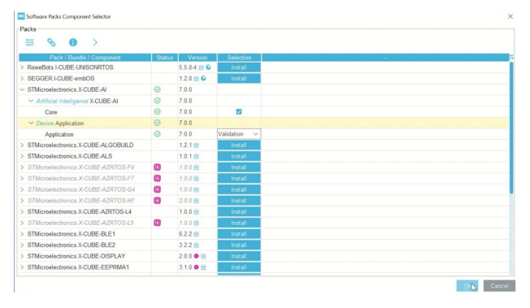
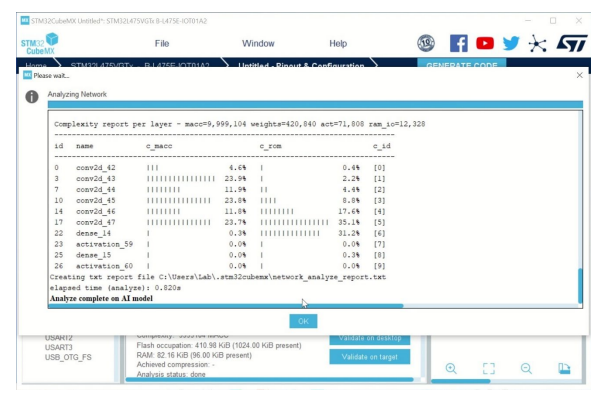
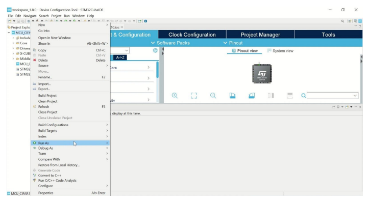
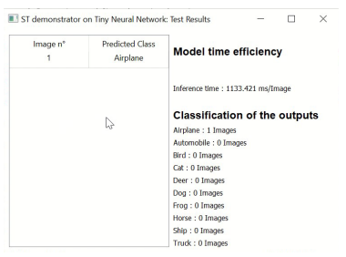

---
# User change
title: "2. Run the image classification NN model on STM32 B-L475E-IOT01A2 board"

weight: 3 # 1 is first, 2 is second, etc.

# Do not modify these elements
layout: "learningpathall"
---

In this section, we will deploy the model we built in the previous section on the ST board using STM Cube AI and STM Cube IDE. STM Cube AI is an extension software of STM Cube MX. So we will need to instal both STM Cube MX and the extension software, STM Cube AI.

## Install STM Cube MX and ST CUbe AI

1. Download the Windows installer of STM32 Cube MX from [here](https://www.st.com/en/development-tools/stm32cubemx.html)
2. Run the Windows installer and install in desired location of your Windows Machine.
3. Open STM Cube MX.
4. Click [Access to Board Selector]. Find your board and click [Start Project].
5. First we need to configure the project. Go to [Project Manager]. Write the project name and select the project location where the project will be saved.
6. This figure shows the configuration of pinouts. We don't need to use all of them. So, we are going to clear the pinouts. On [Pinout] menu, click [Clear pinouts].
7. Now we are going to install Cube AI and enable it for your project.
8. On [Software Packs] menu, click [Select Components].
9. Click [Install] button. Expand the menu and enable Cube AI. For device application, choose [Validation].
10. You can see that Cube AI is now enabled.

## Deploy the model with STM32CubeMX

Open STM32CubeMX. Click [Access to Board Selector]. Find the B-L475E-IOT01A2 board and click [Start Project]. Go to [Project Manager]. Write the project name and configure the project location where the project will be saved. Select the firmware version to use.


Go back to [Pinout & Configuration] and clear pinouts.


On [Software Packs] menu, click [Select Components]. Enable Cube AI. For device application, choose [Validation].



Click [Add network]. Load the model provided (‘Data/models/cifar10_model.h5’) or the model you trained by yourself (‘Data/models/own_cifar10_model.h5’). Click [Analyze] to check the model. Then, generate the validation code for the model by clicking [Generate Code].



Open STM32CubeIDE. Choose ‘Create a New STM32 Project from an Existing STM32CubeMX Configuration File’ to import the project. Go to the project folder and open the .ioc file. Now, make sure that the board is connected to your computer. If it is correctly connected, install the code by clicking [Run As]. 



If you got the ‘undefined reference’ error, go to ‘Core/Src/main.c’. In the file, remove static from the declaration of the ‘MX_USART1_UART_Init’ function and also from it's definition. Then try [Run As] again.


With the model now deployed on the ST board, we are ready to test it.

### Test the model

For testing, we are going to use a custom tool for sending images to the board. The tool is provided by STMicroelectronics. Open Anaconda Prompt and activate your environment for the lab. We need to install several packages to run the tool.

```console
 python -m pip install -U opencv-python protobuf tqdm==4.50.2
```
Navigate to the lab4 folder. Enter [Misc] folder. Then you can execute the tool by typing the following command

```
cd ~/Documents/lab4/Misc
python ui_python_ai_runner.py
```
Click the black button on the board to reset the board and check [Refresh NN and camera]. You can see the list of models deployed on the board.


Select the network (‘Data/models/cifar10_model.h5’) and open the label file (‘Data/labels/cifar10_labels.txt’)


Open an image to test. The tool will automatically show the inference result. We can see that the model correctly predicted the label. In addition, we can see the time taken to finish the prediction.



You can also use your own camera to test image classification. If you press [S], the tool captures the image and sends it to the board.


You have now successfully tested the model on your ST board.


